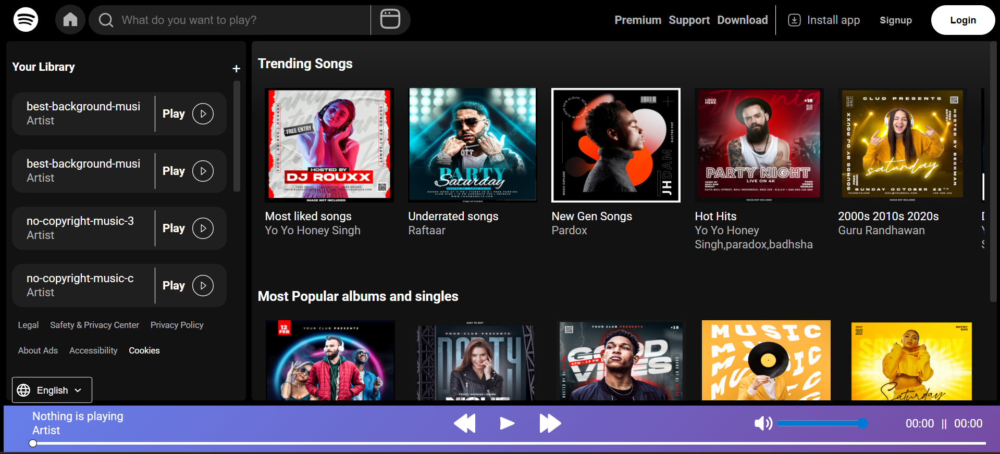
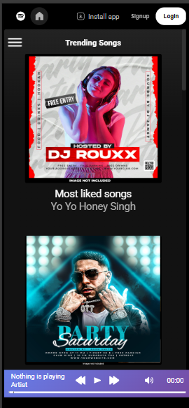
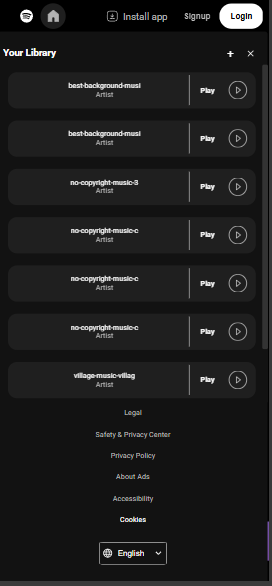

# 🎵 Spotify Clone 2.0

A responsive **Spotify Clone** built using **HTML, CSS, and JavaScript**.  
It dynamically fetches albums and songs, displays them in a sidebar, and features a fully functional custom playbar made from scratch.

---

## 🚀 Features
- 🎶 Fetch and display albums & songs using `fetch()`
- 📂 Sidebar playlist navigation
- ▶️ Custom playbar with play, pause, seek, and volume controls
- 📱 Fully responsive design for desktop & mobile
- 🎨 Built from scratch with **vanilla HTML, CSS, and JavaScript**

---

## 📂 Project Structure

spotify-2.0/<br>
│── assets/<br>
│ ├── icons/ # UI icons<br>
│ └── songs/ # MP3/Audio files<br>
│── index.html # main HTML file<br>
│── script.js # main logic<br>
│── style.css # styling<br>
│── utility.css # utility classes<br>
│── favicon.ico # site favicon<br>
│── README.md # project documentation<br>


---

## 📸 Screenshots

<br><br>
## 📸 Screenshots
<h3>Mobile View</h3>
<p align="center">
  &nbsp;&nbsp;&nbsp;&nbsp;&nbsp;&nbsp;
  
</p>

---

## ⚙️ Getting Started

1. Clone the repository:
   ```bash
   git clone https://github.com/Daksh-Official/spotify-2.0.git
   ```
2. Navigate into the folder:
   ```bash
   cd spotify-2.0
   ```
3.  Open index.html in your browser:
   ```
    # on mac/linux
    open index.html

    # on windows
    start index.html
```
4. Enjoy the music 🎧

🛠️ Tech Stack:<br>
=> HTML5<br>
=> CSS3<br>
=> JavaScript (ES6+)

👨‍💻 Author
Made with ❤️ by Daksh

note: I made this project for practice so there may or may not be any future changes but use it however you like just star and fork the repo if possible also this project is not for commercial use.
 
